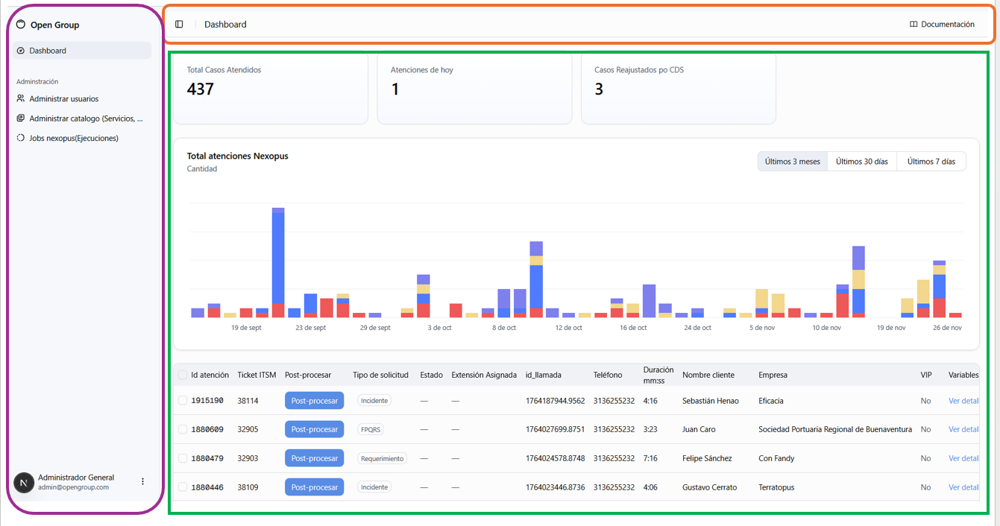

# Navegación general

La interfaz de **Nexopus** está diseñada para ser intuitiva y modular.

## Elementos principales

- **Encabezado superior (recuadro naranja):** Presenta el nombre de la sección o módulo donde se está ubicado dentro de la interfaz. Además, contiene el botón con enlace a la documentación de la aplicación.

- **Barra lateral izquierda (recuadro violeta):** Contiene los accesos directos a los otros módulos como Dashboard, Adminstración y Ciberseguridad (proximamente). 

!!! note "Observación"
    Si no encuentras un módulo, verifica tus **permisos** o comunícate con el administrador. Para usuarios sin permisos de adminsitrador sólo se presenta el dashboard.

- **Área central (recuadro verde):** Presenta las vistas, formularios e información general del sistema.
 
---

